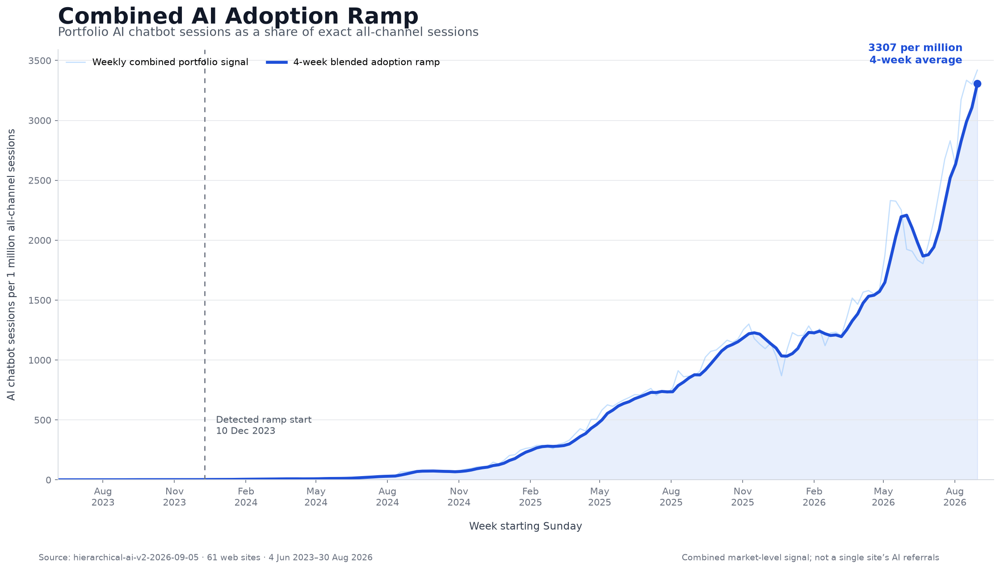

# Hierarchical AI-impact model

Stakeholder note for econometric review. Current promoted artifact: `hierarchical-ai-v2-2026-09-05` (61 web properties after excluding apps; weekly fitted panel 2023-06-04 to 2026-07-26; corrected portfolio signal through 2026-08-30). The fit ends where the latest available real Google Trends controls end; no Trends values were extrapolated. This is an observational, hierarchical Bayesian time-series model. It is not a randomized experiment and does not estimate purchase or conversion effects.

## What changed vs `hierarchical-ai-v1`

| | v1 | v2 (`CURRENT`) |
| --- | --- | --- |
| Sites | 81 properties (web + app) | **61 web** properties (`website_type != app`) |
| AI share denominator | Sum of channel-dimensioned sessions (biased) | Exact GA4 **`All Sessions`** row (sessions are not additive across channels) |
| AI share numerator | Channel-tagged AI Chatbots only | AI Chatbots plus **source overlay** outside GA4’s native AI Assistants channel |
| Signal end | 2026-07-19 | **2026-08-30** |
| Detected ramp start | 18 Feb 2024 | **10 Dec 2023** (same 3× rule; earlier because the corrected share rises sooner) |
| Fit draws | 2 chains × 250 | **4 chains × 1000** |

The corrected share is several times larger in recent weeks than the v1 series (same calendar weeks are not comparable level-for-level). Category semi-elasticities were therefore re-estimated on the new panel and transform.

## Question

How many **SEO** and **Direct** sessions on a site are associated with the rise of AI chatbots, after holding brand search interest, a site-specific linear trend, and category seasonality fixed?

The object of interest is a **counterfactual freeze**: sessions under the observed AI-adoption path minus sessions if the AI index had stayed at its pre-ramp baseline.

## Panel and treatment

**Unit.** Site-week. Weeks start Sunday. Incomplete weeks and weeks with zero SEO or Direct sessions are dropped. Week-starts 15 Dec–7 Jan are dropped (Christmas/NY retail spikes dominate the smoother AI and Trends series).

**Outcomes (separate models).** \(y^{seo}_{it} = \log(\text{SEO sessions}_{it})\) and \(y^{direct}_{it} = \log(\text{Direct sessions}_{it})\). Purchases and CVR are measured in GA4 and shown as context only.

**Treatment.** A **portfolio-wide** AI-adoption index, not the site’s own AI-channel sessions:

\[
s_t = \frac{\sum_i \text{AI Chatbots sessions}_{it}}{\sum_i \text{All Sessions}_{it}}.
\]

Every site sees the same \(s_t\) in a given week. That is by design: the scientific claim is about **market-level AI proliferation**, not about a site’s own chatbot referrals (those are reported separately as observed traffic).

**Transform (frozen).** Raw share is tiny and right-skewed. The fitted predictor is a scaled log, with constants locked on weeks before 1 June 2026 so later refreshes do not silently re-standardise history:

\[
z_t = \frac{\log(1 + s_t / m) - \mu}{\sigma},
\]

where \(m\) is the median positive share in the reference window and \(\mu,\sigma\) are the mean and SD of \(\log(1+s_t/m)\) in that same window. A **capped** variant winsorises the transformed values at the reference P3/P97 (true zeros stay zero). Uncapped \(z_t\) is primary; capped is a tail-sensitivity check.

**Baseline \(z_0\).** Mean of \(z_t\) before the detected ramp (first week where \(s_t\) exceeds 3× the first 26 weeks’ mean; promoted ramp start **10 Dec 2023**).

**Control.** Site-specific Google Trends brand interest, log-transformed with a 0.5 floor (`<1` → 0.5), then **within-site demeaned**. Sites without a Trends series are excluded from the fit (inner join).

**Categories.** Three pooling groups: `advertiser-retail` (37), `advertiser-services` (5), `publisher` (19). Unseen sites are classified into one of these at audit start; they do not get a private AI slope until a later refit.

GSC clicks/impressions are **not** covariates (impression measurement broke in Sep 2025).

## Likelihood

For each outcome, independently:

\[
\begin{aligned}
y_{it}
&= \alpha_i
+ \beta^{\text{trend}}_i \cdot \tau_{it}
+ \beta^{\text{AI}}_{c(i)}\, z_t
+ \beta^{\text{trends}}_i \cdot \widetilde{b}_{it}
+ \gamma_{c(i)}^{\top} f_t
+ \varepsilon_{it}, \\
\varepsilon_{it} &\sim \mathcal{N}(0, \sigma_i^2).
\end{aligned}
\]

- \(\alpha_i\): site intercept (log-level).
- \(\tau_{it}\): within-site centred week index / 52 (linear trend in years).
- \(\widetilde{b}_{it}\): demeaned \(\log(\text{brand interest}_{it})\).
- \(f_t\): Fourier seasonality, annual harmonics 52 and 26 weeks (sin/cos). Shared at **category**, not site.
- \(\beta^{\text{AI}}_{c(i)}\): **category-level** AI semi-elasticity. A 1 SD increase in \(z_t\) multiplies expected sessions by \(\exp(\beta^{\text{AI}}_c)\).

**Why no site-level AI slope.** \(z_t\) has **no cross-sectional variation**. A site-specific \(\beta^{\text{AI}}_i\) is not identified separately from that site’s residual trend/noise. An earlier three-level AI hierarchy produced divergences and sign-flipping counterfactuals; it was removed.

Brand Trends **does** vary by site, so it keeps a three-level hierarchy (global → category → site). AI keeps two levels (global → category).

## Priors (non-centred)

\[
\begin{aligned}
\mu_{\text{AI}} &\sim \mathcal{N}(0, 0.5), &
\tau^{\text{AI}}_{\text{cat}} &\sim \text{HalfNormal}(0.3), \\
\beta^{\text{AI}}_c &= \mu_{\text{AI}} + \tau^{\text{AI}}_{\text{cat}}\, z^{\text{AI}}_c, &
z^{\text{AI}}_c &\sim \mathcal{N}(0,1), \\[4pt]
\mu_{\text{trends}} &\sim \mathcal{N}(0.3, 0.3), &
\tau^{\text{trends}}_{\text{cat}} &\sim \text{HalfNormal}(0.25), \\
\tau^{\text{trends}}_{\text{site}} &\sim \text{HalfNormal}(0.2).
\end{aligned}
\]

Site intercepts, trends, and log-residual SDs are also partially pooled. Inference is NUTS (target accept 0.95), non-centred everywhere a parent scale is itself unknown. Training uses 4 chains × 1000 warmup × 1000 samples.

## Identification, in one paragraph

The AI coefficient is identified from **common time-series variation** in \(z_t\) after partialling out (i) a site intercept, (ii) a site linear trend, (iii) category Fourier seasonality, and (iv) the site’s own brand-search cycle. Remaining threats are any **common shock correlated with chatbot adoption** that is not absorbed by those controls (algorithmic ranking changes, category demand, macro). The sign of \(\beta^{\text{AI}}_c\) can be positive (AI expands the channel) or negative (AI substitutes for classic SEO/Direct). Category pooling is what makes a cold-start for an unseen site possible.

## Counterfactual

Hold \(\alpha_i\), trend, Trends, and seasonality at their fitted values. Compare expected sessions at observed \(z_t\) versus \(z_0\).

**In-sample / site-inclusive refit** (model fitted mean):

\[
\Delta_{it}^{(d)}
= \exp\!\big(\mathbb{E}[y_{it}\mid z_t]^{(d)}\big)
- \exp\!\big(\mathbb{E}[y_{it}\mid z_0]^{(d)}\big).
\]

**Cold start** (unseen site; do not invent \(\alpha_i\) or a site AI slope). Apply stored category draws to **observed** sessions \(Y_{it}\):

\[
Y^{cf,(d)}_{it} = \frac{Y_{it}}{\exp\!\big(\beta^{\text{AI},(d)}_{c}\, (z_t - z_0)\big)},
\qquad
\Delta_{it}^{(d)} = Y_{it} - Y^{cf,(d)}_{it}.
\]

Reported figures: posterior mean of \(\sum_{t \in W} \Delta_{it}\) over the last 13 complete overlapping weeks, with a **94% credible interval** (3rd–97th percentiles). Uncapped vs capped is shown as a sensitivity delta. “Robust” means both specifications agree in sign and neither CI includes zero.

Direct AI-channel sessions in GA4 are **not** this \(\Delta\). They are a measured residual channel; the model estimates displacement/complementarity in SEO and Direct.

## Two scoring modes

| Mode | When | What is used |
| --- | --- | --- |
| `category_posterior` | Immediate | Frozen \(\beta^{\text{AI}}_c\) draws × this site’s observed SEO/Direct. Signal is the portfolio index with this site’s weekly AI and total sessions **added** for overlapping weeks, then the frozen transform is reapplied. |
| `site_refit` | ≥ 8 complete non-Christmas weeks with GA4 + brand Trends | Site is appended to the training panel; NumPyro is refit (SEO/Direct × uncapped/capped). Site still has **no private AI slope**; it contributes to the category posterior and to the portfolio index. |

Signal publication can refresh \(s_t\) without refitting posteriors. Weeks newer than the published signal are withheld until refresh.

## Promoted category slopes (`hierarchical-ai-v2-2026-09-05`, uncapped)

Posterior mean of \(\beta^{\text{AI}}_c\) [94% CI]. A positive number means higher AI adoption is associated with **more** sessions in that channel. Magnitudes are **not** comparable to v1 without re-standardising \(z_t\).

| Category | SEO | Direct |
| --- | --- | --- |
| Advertiser–retail | +0.264 [0.244, 0.284] | +0.113 [0.086, 0.140] |
| Advertiser–services | −0.085 [−0.119, −0.049] | −0.108 [−0.178, −0.040] |
| Publisher | −0.007 [−0.030, +0.016] | −0.086 [−0.115, −0.058] |

The global \(\mu_{\text{AI}}\) remains weakly identified (wide CI covering zero). Category deviations are the operational parameters. Relative to v1, retail effects are stronger (especially SEO), services SEO and Direct both exclude zero on the downside, and publisher SEO stays near flat while Direct remains negative.

**Promotion.** `CURRENT` → `hierarchical-ai-v2-2026-09-05`. All four production fits: 0 divergences, \(\hat R=1.00\), min bulk ESS 1,400 (Direct uncapped). All six hold-one-site-out cells **agree in sign**. Interval overlap is high for five of six cells; services Direct overlap is 0 (cold-start magnitude much larger than site-refit) while the sign still agrees — treat that cell’s size, not direction, as less stable. Input-data digest: `271ee31daa76894f04be74b06d303d71582789b4e1396bf673f948c7b67977bb`. Training panel version: `61-site-ga4-brand-trends-v2` (154 fitted weeks × 61 sites).

## AI adoption index (chart)

Weekly portfolio \(s_t\) (per million all-channel sessions) with a 4-week blend. Latest 4-week average ≈ **3,307 per million** (week starting 30 Aug 2026). Source: promoted artifact `portfolio_signal.csv.gz` (also mirrored at `research/modelling/plots/ai_index_by_week.csv`). Plain-English guide: `docs/AI_ADOPTION_INDEX.md`.

## What this is not

- Not DiD, synthetic control, or an IV design.
- Not a site-specific AI elasticity at cold start.
- Not a purchase or CVR model.
- Not identified from the site’s own “AI Chatbots” channel (that would confound the treatment with the outcome).
- Not robust to unmeasured common shocks that track chatbot adoption.

Implementation: `research/modelling/custom_ci.py` (fit), `research/modelling/train_baseline_artifact.py` (artifact bundle), `backend/ai_impact/scoring.py` (cold start), `jobs/ai_impact_refit/` (site-inclusive refit), `jobs/ai_signal_refresh/` (signal-only refresh).
