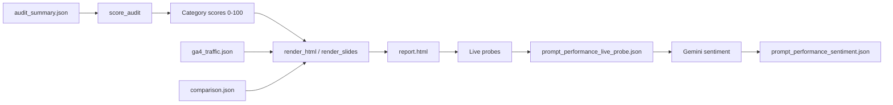

# Analysis and scoring

How audit **results** are produced: the scoring engine, post-audit intelligence, and output artifacts. For *where data comes from*, see [DATA_SOURCES.md](DATA_SOURCES.md).

---

## End-to-end result generation



1. **Crawl** produces `audit_summary.json` (raw signals).
2. **`score_audit()`** in `create-report.py` computes subscores and three category scores → overall GEO score (0–100).
3. **`generate_reports()`** renders HTML/slides from scored audit + optional GA4/comparison JSON.
4. **Post-audit** (web path): live LLM probes and Gemini sentiment augment the report UI.

---

## Overall score structure

**Weights** (`create-report.py` → `DEFAULT_WEIGHTS`):

| Category | Weight | Skill doc |
|----------|--------|-----------|
| **AI Visibility** | 40% | `skills/create-report.md`, pillar skills |
| **Technical Setup** | 30% | `skills/technical-audit.md`, `ai-crawler-report.md` |
| **Content Quality & Structure** | 30% | `skills/eeat.md`, `json-ld.md`, `ai-citability.md` |

Overall score = weighted sum of category scores (normalised to 100 if weights drift).

Entry point:

```python
score_audit(audit: dict) -> tuple[float, list[AgentCategoryResult]]
```

`audit` is the parsed `audit_summary.json` dict (mutated in-place with breakdown metadata).

---

## AI Visibility (40%)

Subscores combined into this category:

| Subscore key | Label | Method (summary) |
|--------------|-------|------------------|
| `ai_citability` | AI citability | Blend of technical extractability (meta, OG, structured data) and **passage heuristics** from crawl body text (editorial vs product-grid listings) |
| `brand_visibility` | Brand visibility | On-site entity proxy + off-site scan (Wikipedia, YouTube, Reddit, LinkedIn) via `score_brand_visibility()` |
| `platform_readiness` | Platform readiness | Average of OG, entity, and meta subscores — preview clarity for AI/social surfaces |
| `ai_search_success` | AI search success | **Google AI Search readiness proxy** — nine-theme weighting (content, crawl/index, structured data, snippets, page experience, multimodal, entity ecosystem, visit quality, freshness) |
| `entity_clarity` | Entity clarity | Brand ↔ site ↔ `sameAs` consistency |
| `query_coverage` | Query coverage | URL/title signals + passage proxies for FAQ/comparison/how-to style queries |

Key functions: `_passage_citability_proxy_for_audit()`, `score_brand_visibility()`, `score_google_ai_search_success()`, `_query_coverage_passage_proxy_for_audit()`.

**Confidence metadata** stored on audit: `_citability_breakdown`, `_ai_visibility_meta` (listing-heavy samples cap citability).

---

## Technical Setup (30%)

| Subscore | Method |
|----------|--------|
| **AI crawler robots** | `score_ai_crawler_robots()` — parses robots.txt against known AI bots (GPTBot, ClaudeBot, Google-Extended, etc.); tiered allow list aligned with `samples/robots.txt` |
| **Crawl infrastructure** | Redirect chains, status code ratio, crawl depth signals (`_subscore_crawl_infra`) |
| **TLS / HTTP** | Certificate verification mode + 200 OK ratio |
| **SSR / HTML completeness** | `_ssr_html_completeness_proxy()` — detects JS-shell vs server-rendered content |

Robots breakdown: `audit["_ai_crawler_score_breakdown"]`.

---

## Content Quality & Structure (30%)

| Subscore | Method |
|----------|--------|
| **Structured data** | `_subscore_structured()` — JSON-LD presence, types, completeness |
| **Meta / titles** | `_subscore_meta()` |
| **Open Graph** | `_subscore_og()` |
| **E-E-A-T proxies** | Author, about, contact signals from crawl (see `skills/eeat.md`) |

Content signals aggregated across pages: `_aggregate_crawl_content_signals(pages)` — listing vs editorial fractions drive citability caps.

---

## Competitive comparison

When competitors are crawled, `create-report.py`:

1. Scores each competitor `audit_summary.json` with the same `score_audit()` logic.
2. Builds `comparison.json` — table of overall + category scores.
3. Renders competitive section in `report.html` (`build_competitive_section()`).

---

## GA4 analysis in reports

`ga4_traffic.json` is **not** folded into the 0–100 GEO score by default; it powers an **appendix** in the HTML report:

| Analysis | Description |
|----------|-------------|
| Monthly AI sessions trend | AI bucket vs total sessions |
| Sessions by AI source | Stacked chart by `sessionSource` |
| Channel gap table | AI-like referrers misclassified outside AI bucket |
| Conversion rate | All channels vs AI segment (`ecommercePurchases / sessions`) |
| Monthly AI revenue % | When revenue + custom AI channel configured |

Rendering: `create-report.py` GA4 appendix helpers; copy softened via `report_copy.py`.

Optional Gemini narrative: `insights_llm.generate_ga4_insights()` → `ga4_ai_insights.json`.

Methodology spec: `skills/ga4-traffic.md`.

---

## Live probe analysis (post-audit)

### Share of voice (SOV)

**Module:** `api/sov_metrics.py` + `prompt_suggest.py`

For each probe response:

1. Detect brand mentions (client name, domain, configured aliases).
2. Detect competitor mentions.
3. Aggregate hit rate per platform and prompt category.

Displayed in report UI as SOV charts/tables (fed by `prompt_performance_live_probe.json`).

### Probe reply sentiment

**Module:** `insights_llm.py`

After probes complete, Gemini classifies reply tone toward the client brand by product category → `prompt_performance_sentiment.json`.

---

## On-demand LLM sections

Triggered from UI (not automatic on every audit):

| Section | Input context | Output |
|---------|---------------|--------|
| Executive summary | Scores, top findings, GA4 headline | `executive_summary.json` |
| Recommendations | Findings + `skills/action-plan.md` framing | `recommendations.json` |

Cached on disk; regenerated when user clicks refresh in UI.

---

## Report outputs

Per audit directory (`audit_output/<host>_<hash>/`):

| File | Description |
|------|-------------|
| `audit_summary.json` | Raw crawl + score inputs (pre-HTML) |
| `report.html` | Full client report (primary deliverable) |
| `report_slides.html` | Slide-oriented layout |
| `comparison.json` / `.md` | Competitor score table |
| `ga4_traffic.json` | GA4 appendix data |
| `onboarding_context.json` | Wizard context |
| `products_and_services.json` | Products + probe prompts |
| `prompt_performance_live_probe.json` | LLM probe results |
| `prompt_performance_sentiment.json` | Gemini sentiment |
| `executive_summary.json` | Optional cached summary |
| `recommendations.json` | Optional cached action plan |
| `audit_run_status.json` | In-progress / complete (web polls) |

### Export formats

| Format | Module |
|--------|--------|
| PDF | `api/pdf_service.py` (Playwright print of `report.html`) |
| All-pages HTML | `api/html_service.py` |

### Archive

`audit_archive/index.json` — list of runs with `audit_dir`, score, owner email, timestamp.

---

## Offline research (`research/`)

Separate from audit scoring. Used for econometric uplift analysis:

| Script | Method |
|--------|--------|
| `ga4_channel_export.py` | GA4 Data API daily export by `sessionDefaultChannelGroup` |
| `counterfactual.py` | Statsmodels panel OLS — log sessions on SEO/PPC/brand index with seasonality; counterfactual predictions by period |
| `smf.py` | Related regression / counterfactual evaluation on weekly site data |
| `trend_index.py` | Trend index construction from BigQuery CSV |

These do **not** affect `report.html` unless you merge outputs manually.

---

## Rebuilding reports without re-crawl

```bash
export PYTHONPATH=backend
python backend/create-report.py --only-report audit_output/www.example.com_abc123def456
```

Re-runs `score_audit()` + HTML from existing `audit_summary.json`. Useful when tuning scoring or copy.

---

## Where to change behaviour

| Change | Location |
|--------|----------|
| Category weights | `DEFAULT_WEIGHTS` in `backend/create-report.py` |
| New subscore | New `_subscore_*` or `score_*` function + wire in `score_audit()` |
| Report copy / tone | `backend/report_copy.py`, HTML templates in `backend/create-report.py` |
| GA4 charts | `backend/ga4_fetch.py` + GA4 appendix in `backend/create-report.py` |
| Probe platforms | `api/probe_platforms.py`, `backend/prompt_suggest.py` |
| SOV logic | `api/sov_metrics.py` |
| Rubric documentation | `skills/<pillar>.md` |

Always cross-check skill markdown when changing scoring — skills explain stakeholder-facing intent; code implements proxies.

---

## Limitations (by design)

- Scores are **automated proxies**, not manual SEO/GEO audits.
- Passage citability uses heuristics (listing vs editorial); thin template sites score lower by design.
- GSC is not integrated — organic query data requires manual checks.
- LLM probes are point-in-time model responses; SOV varies by model and date.
- GA4 requires user OAuth or service account with property access; sampling/thresholding may apply per GA4 property settings.
