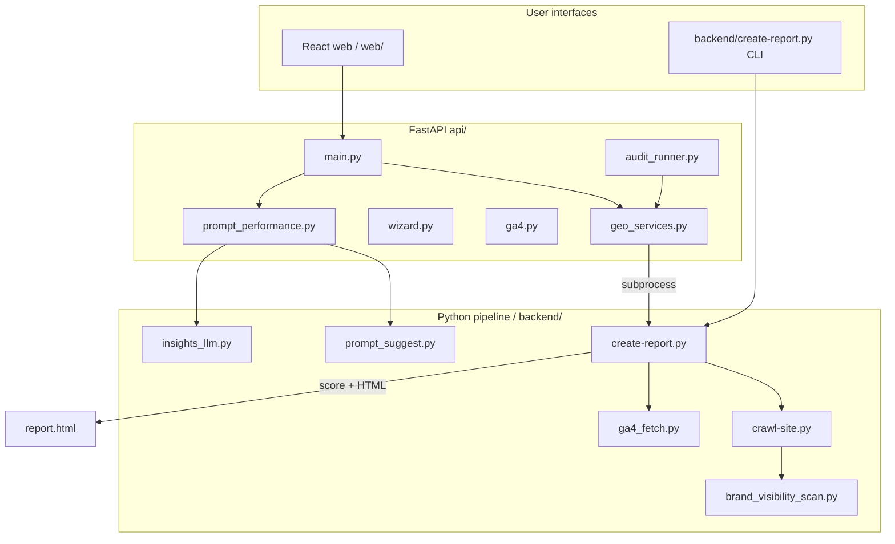

# Architecture

This document describes how the SEO/GEO audit tool is structured, how requests flow through the system, and where to look when extending functionality.

---

## System overview



**Orchestrator:** `backend/create-report.py` — everything in a full audit eventually runs through this script (directly or as a subprocess).

**Web glue:** `api/geo_services.py` — builds subprocess commands, manages `audit_output/` paths, archive index, and report serving.

---

## Entry points

| Entry | Path | When to use |
|-------|------|-------------|
| **Web dev** | `scripts/run_web_dev.sh` | Day-to-day development (Vite + uvicorn) |
| **FastAPI** | `api/main.py` | Production Cloud Run service |
| **CLI audit** | `backend/create-report.py` | Headless runs, debugging scoring/crawl |
| **Crawl only** | `backend/crawl-site.py` | Isolate crawl issues |

### Web audit flow

1. User completes wizard (`web/` → `api/wizard.py`): brand URL, market, products, competitors, prompts, optional GA4 connect.
2. `POST /api/audits/run` or `/run-background` (`api/main.py`, `api/audit_runner.py`).
3. `geo_services.seed_audit_dir_from_wizard()` writes stub JSON into `audit_output/<host>_<hash>/`.
4. `geo_services.iter_pipeline_logs()` spawns `backend/create-report.py` with argv built from wizard + GA4 session creds.
5. Progress UI maps subprocess log lines → steps via `api/audit_progress.py`.
6. Post-audit: `api/prompt_performance.run_post_audit_prompt_insights()` (live probes + sentiment).
7. `geo_services.archive_add_run()` appends to `audit_archive/index.json`.

### CLI audit flow

```bash
export PYTHONPATH=backend
python backend/create-report.py https://example.com \
  --competitor https://peer.com \
  --out audit_output \
  --ga4-property 123456789 \
  --ga4-ai-channels "AI"
```

Same pipeline as the web UI, without wizard seeding or post-audit probes unless you run those separately.

---

## Audit pipeline stages

Order matches `api/audit_progress.py` (`PIPELINE_STEPS`):

| Step | What happens | Primary modules |
|------|----------------|-----------------|
| **crawl** | Primary site HTTP crawl | `backend/create-report.py` → `backend/crawl-site.py` |
| **competitors** | Up to 5 competitor crawls + comparison | `backend/crawl-site.py`, `backend/create-report.py` |
| **ga4** | GA4 Data API pull (if property + creds) | `backend/ga4_fetch.py`, `backend/ga4_data_api.py` |
| **report** | `score_audit()` + render HTML | `backend/create-report.py` |
| **prompt_probes** | Live Gemini/OpenAI/Claude answers | `backend/prompt_suggest.py` |
| **sentiment** | Gemini sentiment on probe replies | `backend/insights_llm.py` |
| **finish** | Archive + status file | `geo_services.py` |

---

## Directory reference

### `api/` — HTTP layer

| Module | Role |
|--------|------|
| `main.py` | FastAPI app, routers, static `web/dist` |
| `geo_services.py` | Audit paths, subprocess runner, archive |
| `audit_runner.py` | Background audit thread + `audit_run_status.json` |
| `audit_progress.py` | Log line → progress step mapping |
| `wizard.py` | Setup wizard endpoints |
| `ga4.py` | GA4 OAuth (`/api/ga4/login`, `/callback`, property list) |
| `ga4_config.py` | OAuth client resolution |
| `auth.py` / `auth_config.py` | Google sign-in for web UI |
| `iap.py` / `iap_middleware.py` | Cloud IAP JWT (staging/production) |
| `prompt_performance.py` | Probe orchestration and SOV APIs |
| `sov_metrics.py` | Share-of-voice calculations |
| `executive_summary.py` | On-demand Gemini summary |
| `recommendations.py` | On-demand Gemini action plan |
| `html_service.py` / `pdf_service.py` | Multi-page HTML and Playwright PDF |

### `backend/` — pipeline core

| Module | Role |
|--------|------|
| `create-report.py` | Scoring engine, HTML synthesis, competitive tables, GA4 appendix |
| `crawl-site.py` | Robots, llms.txt, sitemaps, page sampling, JSON-LD extraction |
| `brand_visibility_scan.py` | Wikipedia, YouTube, Reddit, LinkedIn presence |
| `ga4_fetch.py` | Builds `ga4_traffic.json` for reports |
| `ga4_data_api.py` | GA4 client, custom channel metadata, report helpers |
| `ga4_oauth.py` | User OAuth (web + CLI) |
| `prompt_suggest.py` | Multi-platform live probes |
| `insights_llm.py` | GA4 narrative + probe reply sentiment |
| `geo_setup_llm.py` | Wizard Gemini helpers |
| `competitor_suggest.py` | Gemini transport (API key / Vertex) |
| `executive_summary_llm.py` / `recommendations_llm.py` | Cached LLM report sections |
| `report_copy.py` | Stakeholder-friendly wording |
| `geo_app_env.py` | Environment loading (`BACKEND_ROOT`, `REPO_ROOT`, `ASSETS_ROOT`) |
| `geo_market.py` / `sitemap_market.py` | Market country and regional sitemap logic |

See [backend/README.md](../backend/README.md) for the full module list.

### `assets/` — static design and samples

| Path | Role |
|------|------|
| `assets/design/` | Report CSS and HTML design references |
| `assets/reference/` | Reference `robots.txt`, `llms-txt-skeleton.txt` for crawl merge |
| `assets/samples/` | Local-only demo audits (gitignored) |
| `assets/data/` | Static reference data (e.g. Tranco domain list) |

### `web/` — frontend

React 19 + Vite + Tailwind. Built to `web/dist/` and served by FastAPI in production. Dev proxy forwards `/api` to uvicorn.

### `skills/` — rubric documentation

Markdown specs that define *what* each pillar measures. Scoring logic lives in `create-report.py`; skills are the source of truth for intent and copy.

| Skill file | Pillar |
|------------|--------|
| `ai-citability.md` | Passage-level citability heuristics |
| `ai-crawler-report.md` | robots.txt AI crawler rules |
| `ai-search-success.md` | Google AI Search readiness proxy |
| `brand-visbility.md` | Off-site entity presence |
| `platform-readiness.md` | OG/meta/platform cards |
| `technical-audit.md` | Crawl infra, TLS, SSR |
| `eeat.md` | E-E-A-T signals |
| `json-ld.md` / `llms-txt.md` | Structured data and llms.txt |
| `ga4-traffic.md` | GA4 AI channel methodology |
| `competitors.md` | Competitive comparison |
| `create-report.md` | Full report synthesis spec |
| `action-plan.md` | Prioritised recommendations |

### `research/` — research sandbox

**Not part of the production audit UI.** Standalone scripts for econometric analysis and bulk GA4 exports:

- `research/ga4_channel_export.py` — daily sessions/purchases by default channel group
- `research/counterfactual.py` / `research/smf.py` — panel regression and counterfactuals on weekly traffic
- `research/trend_index.py` — trend index from BigQuery exports

---

## Authentication patterns

| Mode | Config | Used by |
|------|--------|---------|
| **None** | Default local dev | API allows anonymous access |
| **Google OAuth** | `[auth]` in `secrets.toml`, `WEB_PUBLIC_ORIGIN` | Web UI sign-in |
| **Cloud IAP** | `IAP_ENABLED`, `IAP_AUDIENCE` | Staging/production behind load balancer |
| **GA4 user OAuth** | `GA4_OAUTH_*`, `/api/ga4/callback` | Wizard GA4 connect |

GA4 audit subprocesses receive user credentials via a temporary `authorized_user` JSON (`ga4_oauth.write_temp_application_default_user_json`) passed as `GOOGLE_APPLICATION_CREDENTIALS`.

---

## Deployment (Cloud Run)

See [deploy/README.md](../deploy/README.md).

- **Image:** `deploy/Dockerfile` — Node build stage + Python API + Playwright (`PYTHONPATH=/app/backend`)
- **Service:** `geo-audit-staging` / `geo-audit-dev` (see `deploy/cloudrun-*.yaml`)
- **Storage:** GCS bucket mounted at `/var/geo-data` → `GEO_DATA_ROOT`
- **Deploy:** `scripts/deploy_cloud_run_staging.sh`, `scripts/cloud_run_configure_ga4_oauth.sh`

The container runs uvicorn on port 8080 and spawns `backend/create-report.py` inside the same pod (up to 3600s timeout).

---

## Extending the tool

| Goal | Start here |
|------|------------|
| New scoring signal | `backend/crawl-site.py` (collect) → `backend/create-report.py` (`score_audit`, subscore fn) → `skills/*.md` (document) |
| New report section | `backend/create-report.py` (`render_html`) + optional `web/` component |
| New API endpoint | `api/main.py` or new router module |
| New data source | Fetch module + wire in `backend/create-report.py` or post-audit hook |
| Wizard field | `api/wizard.py` + `web/` form + `onboarding_context.json` schema |

Always run a full audit locally after pipeline changes:

```bash
export PYTHONPATH=backend
python backend/create-report.py https://example.com --out audit_output
```
